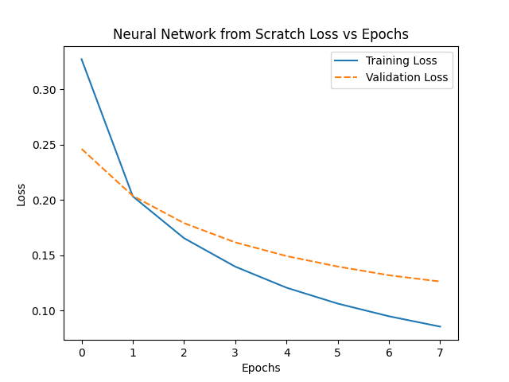
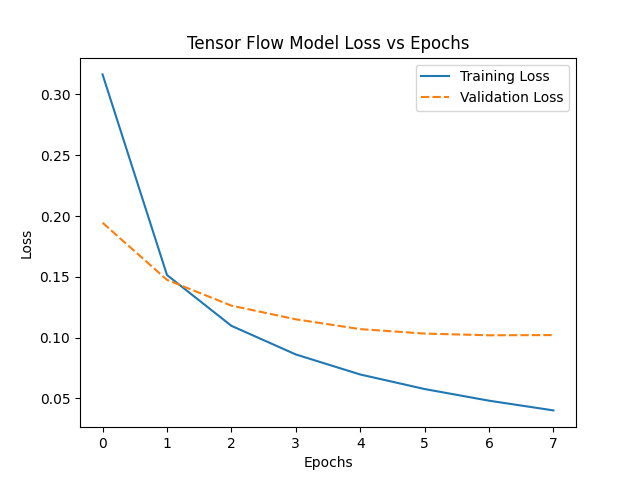
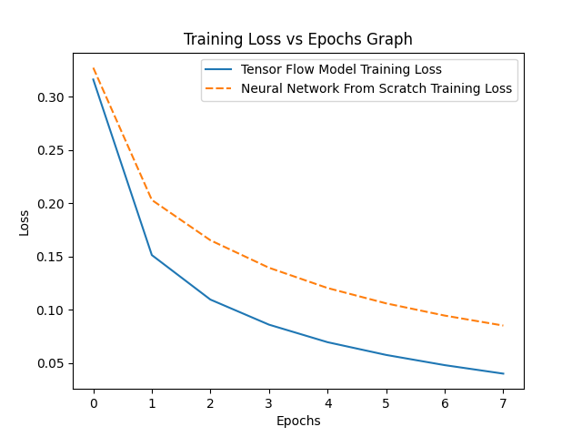
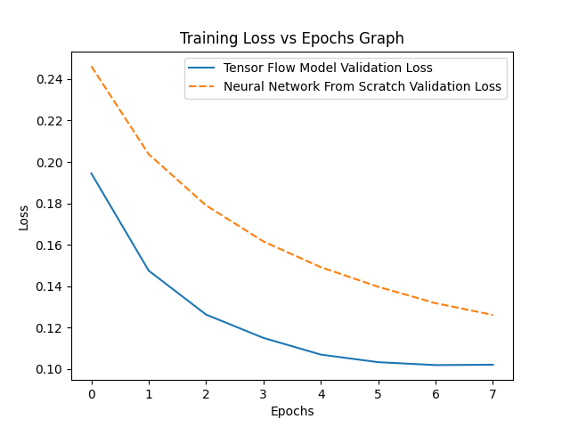
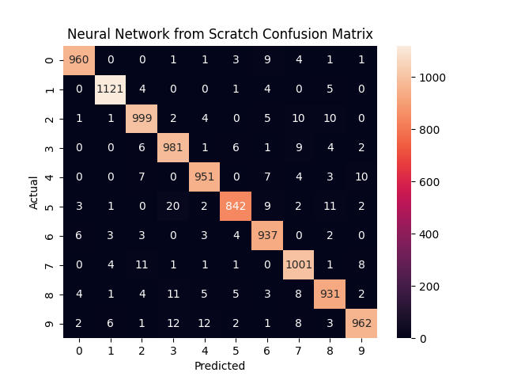
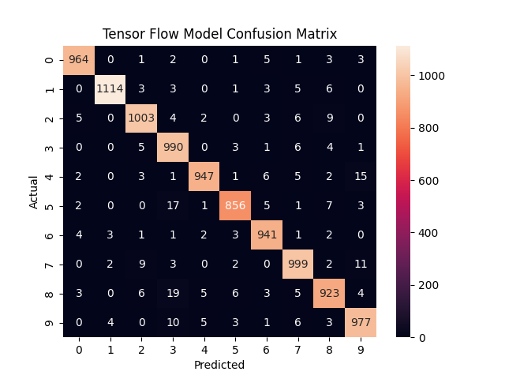

# Neural Network From Scratch

## Overview 
A fully connected Neural Network implemented from scratch, only using NumPy as a major Python library, with batch training and backpropagation
The implementation is validated by comparing loss metrics against an equivalent TensorFlow Model

## Features
- Fully-connected neural network implemented from scratch using NumPy
- Batched forward and backward propagation (matrix-based)
- Supports multiple activation functions (ReLU, softmax, sigmoid, tanh)
- Supports multiple loss functions (Mean Squared Error, Mean Absolute Error, Categorical Crossentropy, Sparse Categorical Crossentropy)
- Supports multiple optimizers (Momentum, RMSProp, Adam)
- Tracks the history of Loss and Validation in each Epoch
- Currently only supports a list of vectors as inputs and outputs a list of column vectors

## Project Structure

```
Neural Network From Scratch/
    ├── Layers.py               # Input and Dense Layer Code
    ├── Network.py              # Network Management
    ├── utils.py                # Utility Functions
    ├── evaluating.py           # Compares This Network and TensorFlow equivalent
    ├── figures/                # Saved Plots from Comparison
    ├── requirements.txt        # Python Dependencies
    └── README.md  
```

## Requirements

- Python 3.9+
- NumPy
- Seaborn       (for visualizations)
- Pandas        (seaborn dependency)
- Matplotlib    (seaborn dependency)
- TensorFlow    (only required for comparison experiments)
- scikit-learn  (accuracy and confusion matrices)

Install dependencies using:

```bash
pip install -r requirements.txt
```

## Running the Project

To run the TensorFlow comparison experiment and generate evaluation plots:

```bash
python evaluating.py
```

# Model Architecture

The Model supports multiple layers where the network object serves as a container for independent layers.

### Component Breakdown
- Network Container: Manages a list of Layers, handles coordination between forward pass (predicting) and backward pass (learning).
- Layer Object: Each layer is a self-contained unit that maintains:
    - Weights and Biases: Stored as numpy matrices, the weight matrix is initialized using HE initialization and the bias vector is initialized to zeros
    - State: Stores the resulting activation and previous activation for backpropagation calculations

### Data Flow
- Input: A matrix of shape ```(batch_size, input_features)```
- Linear Transformation: Each Layer computes $Z = WX + B$
- Activation: A non-linear activation function is applied to $Z$, becoming the input for the next layer
- Output: The Final layer produces the prediction of shape ```(batch_size, output_features)```

### Backpropagation Mechanism
#### Using the Chain Rule, each layer is responsible for calculating two gradients during the backward pass
- Gradient with respect to Weights/Biases ($\frac{\partial C}{\partial W^l}$, $\frac{\partial C}{\partial B^l}$): Used by the optimizer to update weights

- Gradient with respect to activation ($\delta^l$ or $\frac{\partial C}{\partial z^l}$): Passed backward to the previous layer to calculate Gradients for that layer

## Mathematical Foundation

The following shows 

### 1. Forward Propagation

Each dense layer performs a linear transformation followed by a non-linear activation. For a given layer $l$

$z^{[l]} = W^{[l]}a^{[l-1]} + B^{[l]}$

$a^{[l]} = \sigma (z^{[l]})$

Where:
- $a^{[l-1]}$ is the input matrix from the previous layer
- $W^{[l]}$ and $B^{[l]}$ are the weight and bias matrices
- $\sigma$ is the activation function (e.g. **ReLU**, **Softmax**)

### 2. Loss Functions

To measure the "error" of the network, A loss function is used on the predicted output matrix and the labeled output matrix. For example, **Categorical Cross-Entropy**

For one sample:

$C = -\sum_{j=1}^{N} y_j\log(\hat{y_j})$

Where:
- $N$ represents the number of classifications
- $y_j$ represents the expected value of the $jth$ classification
- $\hat{y_j}$ represents the predicted value of the $jth$ classification

### 3. Backpropgation 
The "learning" happens by calculating the gradient of the loss $C$ with respect to each parameter. We use the chain rule to propagate the error backwards:

### Error at the Output Layer:

If the derivative of the activation function is a **Diagonal Jacobian Matrix**:

$\delta^{[l]} = (\sigma'(z^{[l]}))^T \odot \nabla_{a^{[l]}} C$

Otherwise:

$\delta^{[l]} = J\hspace {1mm}\nabla_{a^{[l]}} C$

Where $J$ is the Jacobian Matrix resulting from $\frac{\partial a^{[l]}}{\partial z^{[l]}}$

### Error of the Layers before the Output Layer:

If the derivative of the activation function is a **Diagonal Jacobian Matrix**:

$\delta^{[l]} = (W^{[l+1]})^T\delta^{[l+1]} \odot \sigma'(z^{[l]})$

Otherwise:

$\delta^{[l]} = J(W^{[l+1]})^T\delta^{[l+1]}$

Where $J$ is the Jacobian Matrix resulting from $\frac{\partial a^{[l]}}{\partial z^{[l]}}$

### Gradients for weights and biases:

$\frac{\partial C}{\partial W^{[l]}} = \delta^{[l]} (a^{[l-1]})^T$

$\frac{\partial C}{\partial B^{[l]}} = \delta^{[l]} $

### 4. Optimization
Once the gradients are calculated, the updates of the parameters are based on the optimizer. For standard **Stochastic Gradient Descent (SGD)**

$W^{[l]} = W^{[l]} - \alpha \cdot \frac {\partial C}{\partial W^{[l]}}$

$B^{[l]} = B^{[l]} - \alpha \cdot \frac {\partial C}{\partial B^{[l]}}$

Where $\alpha$ is the learning rate.

## Testing Model

The Model would be tested against a TensorFlow Equivalent. All architectural and training choices described in this section apply only to the experiment and do not limit the framework itself.

### 1. Experiment Setup:

- Dataset Used: MNIST Digit Classification
- Model Layers: 
    - Input Layer: 784 Inputs
    - Hidden Layer: 64 Units, Activation: **ReLU**
    - Output Layer: 10 Units, Activation: **Softmax**
- Models will be using the same Training, Validation, and Testing Data.
- Models will be trained with **32** batch sizes and **8** epochs
- Classification Cross-Entropy will be the loss function
- Adam will be the chosen optimizer

### 2. Results:

### Loss Curves
 


The training and validation loss curves for both the custom NumPy implementation and the reference model implemented using TensorFlow are shown in the accompanying figures.

Across all epochs, both models exhibit similar **training loss convergence behavior**, Training loss decreasing sharply, then slowly shows the optimizer is working correctly and the model is learning.

The NumPy implementation exhibits **higher validation loss** and **slower convergence** compared to the TensorFlow model. This behavior is expected due to differences in numerical optimization, hardware acceleration, and default hyperparameter tuning present in TensorFlow.  Importantly, the loss curves for both models follow similar trends, indicating that the underlying forward and backward propagation logic is correct. Performance could potentially be improved by refining initialization schemes or implementing additional numerical optimizations.

### Comparing Training Loss Curves



When comparing training loss directly between the two models, both demonstrate:

- Rapid initial loss reduction
- Gradual convergence over later epochs
- No signs of divergence or instability

However, the TensorFlow model converges more efficiently, which is expected given its optimized and low-level performance enhancements. The similarity in loss trajectories suggests that the forward and backward propagation logic in the custom implementation is mathematically correct.

### Comparing Validation Loss Curves



Validation loss trends closely mirror training loss behavior. Both models show decreasing validation loss over time, indicating that learning generalizes beyond the training set.

However, the NumPy model maintains a consistently higher validation loss relative to TensorFlow. This gap remains relatively stable after convergence, suggesting that the difference arises from implementation-level efficiency rather than overfitting or optimization failure.

### Confusion Matrix Analysis

Confusion matrices were generated for both models using the predicted output of the test input and the test output.




Both matrices exhibit similar class-level prediction patterns, with correct predictions concentrated along the diagonal as expected. Misclassifications tend to occur between the same classes in both models usually number with similar patterns, indicating that each model learns comparable decision boundaries.

### Accuracy

On the validation dataset, the NumPy model achieves approximately 96.85% accuracy, compared to 97.14% for the TensorFlow model.

The slightly lower accuracy of the NumPy implementation aligns with the observed higher validation loss and is consistent with the expected effects of reduced numerical optimizations and simpler default configurations. Importantly, the close agreement between both models demonstrates that the network is learning meaningful patterns and that the implemented algorithms are functioning correctly.

## Conclusion

This project demonstrates the successful implementation of a fully connected neural network from scratch using NumPy, capable of performing forward and backward propagation, batch training, and optimization with multiple configurable activation functions, loss functions, and optimizers.

Experimental results comparing the NumPy implementation against a TensorFlow reference model show that, while the NumPy model exhibits slightly higher validation loss and marginally lower accuracy (96.85% vs 97.14%), it follows nearly identical loss and training trends. These results validate the correctness of the forward and backward propagation logic and confirm that the network reliably learns meaningful patterns.

Overall, this project was a very valuable learning experience, providing hands-on insight into the inner workings of neural networks and deepening my understanding of both the mathematical and practical implementation considerations. 

Future improvements could include additional optimizers, cost functions, activation functions, Creating a object for optimizers 

## Resources Used

- Introduction to Calculus behind Backpropagation: https://www.youtube.com/watch?v=tIeHLnjs5U8

- Math behind Adam, RMSProp, Momentum Optimizers:
    - Adam: 
        - https://youtu.be/tuU59-G1PgU?si=aPL86r8NTZoanckL
        - https://www.geeksforgeeks.org/deep-learning/adam-optimizer/
    - RMSProp: 
        - https://youtu.be/ajI_HTyaCu8?si=A4BDTcSotob5A5J3
        - https://www.geeksforgeeks.org/deep-learning/rmsprop-optimizer-in-deep-learning/
    - Momentum: 
        - https://youtu.be/Vce8w1sy0e8?si=WisUxTddSf81NcAa 
        - https://www.geeksforgeeks.org/machine-learning/ml-momentum-based-gradient-optimizer-introduction/

- Matrix Calculus: https://youtube.com/playlist?list=PLhcN-s3_Z7-YS6ltpJhjwqvHO1TYDbiZv&si=KWzvT_ePEAP2Szrl 


